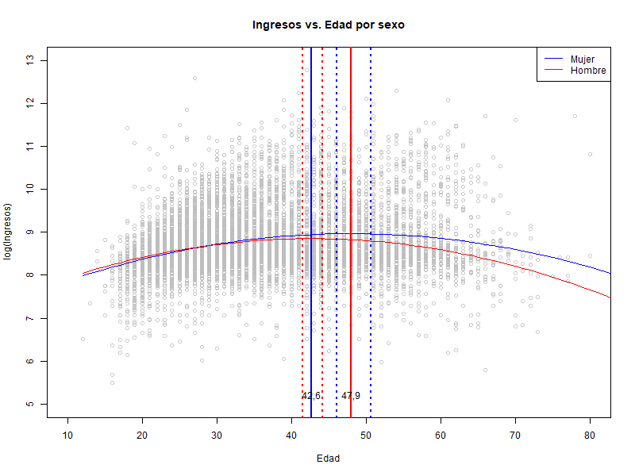

```{r setup, include=FALSE}
require(here)
knitr::opts_chunk$set(echo = TRUE, fig.pos = 'H')

fix_textable_ref <- function(refname, tex_table){
  s <- paste0(fixed("\\caption\\{(\\\\#tab:"), refname, ")")
  o <- gsub("\\caption\\{", s,tex_table)
  o
  }

#source("../scripts/00_packages.R", local = knitr::knit_global())
#library(ggplot2)
here::set_here(path = "../")
source(here("scripts","00_packages.R"), local = knitr::knit_global())
```

```{r prepare_data, echo=FALSE}
db <- arrow::read_parquet("../stores/geih.parquet")
clean_variables <- function(df){
  out_df <- df %>% mutate(
    woman=1-sex,
    woman=factor(woman, levels=c(0,1),labels=c('Hombre','Mujer')),
    maxEducLevel=factor(
      maxEducLevel,levels=1:7),
    uid=paste0(directorio,secuencia_p,orden),
    oficio=factor(oficio, levels=as.double(names(table(db$oficio))))
    )
  out_df
  }

db <- clean_variables(db)
```

# Introducción

Entre 1991 y 2019, el recaudo del impuesto a la renta aumentó en 7,1 puntos porcentuales (p.p.) dentro de la estructura tributaria de América Latina y el Caribe, consolidándose como la segunda fuente de ingresos (26,6%), después de los impuestos generales sobre bienes y servicios [@cepal]. En contraste, para el último año, Colombia se encontró por encima del promedio de sus pares regionales, pues el impuesto a la renta representó el 32,3% de su estructura tributaria; sin embargo, al compararla carga la tributaria de este impuesto, Colombia está lejos del grupo de países más desarrollados del cual hace parte, pues la renta representa el 6,4% del PIB, un valor lejano del promedio de la OCDE (34%).

Más aún para el 2019, el recaudo del impuesto de renta de las personas correspondió a tan sólo al 1,3% del PIB colombiano según la @cepal. Este nivel de ingresos tributarios es considerablemente bajo y se debe al complejo sistema tributario que permite mayores exensiones y deducciones para quienes tienen ingresos más altos [@undp], al mismo tiempo que las políticas, factores psicológicos, coyunturas económicas y deficiencias administrativas favorecen la evasión y elusión de este impuesto sobre los ingresos [@ex].

Cada reforma tributaria ha intentado mejorar los niveles de recaudo en los últimos años, así mismo, los cambios administrativos en la DIAN también han contribuido a este propósito, buscando un sistema tributario más efciente y progresivo, ya que se cuenta con suficiente información y evidencia para identificar sus principales problemas. No obstante, los comportamientos de las personas, sobre todo aquellos asociados a conductas delictivas (como la elusión y evasión), son más difíciles de identificar ante su carácter ilegal y ético. Instrumentos como el aprendizaje de máquinas (ML en adelante, por sus siglas en inglés) pueden complementar y contribuir a aumentar el recaudo de los impuestos, haciendo visible aquello que las personas buscan ocultar o esconder, es decir, generando predicciones sobre los ingresos de las personas a partir de características individuales, de los hogares, o incluso territoriales.

Ha habido varios ejemplos del uso de técnicas de ML para abordar los retos del recaudo de los impuestos. En Indonesia, a través de modelos predictivos se identificaron potenciales pagos a las deudas por impuestos a partir de los registros administrativos de la autoridad fiscal de ese país [@fw]; en Armenia, se pudieron identificar posibles fraudes fiscales a partir de la información reportada por los compradores y vendedores con herramientas de ML [@bdsn]; o en Brasil, Sao Paulo, se identificaron potenciales pagadores, ingresos, el monto de los impuestos y multas a partir de los registros administrativos de autoridad fiscal del municipio [@ig].

Es por tanto, que en este Problem Set busca predecir el ingreso por hora de los y las bogotanas mediante modelos que aprovechan las herramientas del ML, haciendo uso de la principal encuesta de hogares colombiana. Más específicamente, se utilizó la *Medición de Pobreza Monetaria y Desigualdad* [@geih] del 2018 para Bogotá, un módulo de la *Gran Encuesta Integrada de Hogares* (GEIH) del DANE, la cual no sólo proporciona información sobre el mercado laboral, ingreso de las personas, características socioeconómicas y territoriales, si no a su vez representa una fuente de información confiable en la cual las personas no tienen incentivos a reportar información falsa sobre su ingreso, pues la encuesta es anónima y no tiene una finalidad tributaria.

Así, se busca aquí explorar diferentes especificaciones entre el salario y sus determinantes. Estudiaremos el papel de la edad, la educación y del sexo en esta relación, profundizando en como incluir las diferentes ocupaciones/oficios influyen en los resultados [@mincerInvestmentHumanCapital1958]. Todo el material y código para replicar este trabajo se puede encontrar en el repositorio de GitHub disponible en [este enlace](https://github.com/guscastilloa/PS1_Repo-G3).

# Datos

La GEIH es la principal y tal vez más importante encuesta de hogares con la que cuenta Colombia actualmente. Mensualmente, el DANE recolecta información sobre los ingresos y el mercado laboral de una muestra representativa de la población colombiana, de tal manera, que cada mes se obtienen datos sobre el ingreso y mercado laboral para el ámbito nacional, y anualmente para 23 departamentos y Bogotá, sus capitales y áreas metropolitanas, y otros dominios (rural y urbano) [@dane18]. La operación estadística tiene como resultado una base de datos anual de aproximadamente 750 mil observaciones o personas, 230 mil hogares y 30 mil viviendas, la cual permite realizar cálculos y estimaciones sobre la población colombiana.

Aunque la GEIH recolecta información sobre los ingresos y el mercado laboral de la población, se realizan poco más de 150 preguntas a los encuestados que capturan información demográfica, económica y social, de tal manera que se expanden las posibilidades de la encuesta. Es así como esta base de datos también permite caracterizar la migración, micronegocios, la transición entre la educación y el trabajo, trabajo infantil, tecnologías de la información y la pobreza monetaria (dentro de los módulos más importantes). Este último módulo es importante para el desarrollo del presente Problem Set, ya que el DANE agrega los ingresos salariales y no salariales per cápita de las unidades de gasto (hogares para simplificar), identificando las personas con ingresos superiores e inferiores a las líneas de pobreza e indigencia definidas en el Comité de Expertos \footnote{Personas o representante de entidades nacionales o de cooperación internacional con la experticia técnica para orientar la operación estadística, cálculos y estimaciones de la pobreza monetaria}. Es así como la GEIH es también la principal fuente de información para calcular la incidencia, brecha y severidad de esta medición del bienestar de la población.

La GEIH y su módulo sobre la *Medición de Pobreza Monetaria y Desigualdad* están disponibles al público en general a través de la Archivo Nacional de Datos (ANDA) del DANE. Sus módulos anonimizados se pueden descargar y unir para la investigación académica, la toma de decisiones o cualquier propósito individual. En este caso, para el Problem Set no se realizó el descargue de la página del DANE, sino se realizó un *web scraping* de la base de datos filtrada para Bogotá, de la página web de Ignacio Sarmiento Barbieri [@geih] como caso práctico de extracción de contenidos de una página web, con un formato estructurado.

En la página web se encuentran 10 tablas en formato HTML, las cuales contienen en total las 32.177 observaciones que componen la muestra de personas para Bogotá de la GEIH para 2018, con 179 variables (21 variables adicionales a las presentes en la base de datos del ANDA). Al encontrarse en un formato estructurado (tabla HTML), se realizó el *web scrpaing* haciendo uso del paquete `RSelenium` de `RStudio`, con el cual se automatiza la consulta de cada una de los 10 hipervínculos de la página web, se identifica la tabla en HTML, se almacena y posteriormente se consolida una sola base de datos con las características anteriormente mencionadas.

Como complemento, se descargaron y unieron las bases de datos de la GEIH de 2018 [@dane], de tal manera que se obtuviesen variables complementarias para el desarrollo del Problem Set. Más específicamente, los años de escolaridad, la rama de actividad \footnote{Código a dos dígitos de la Clasificación Industrial Internacional Uniforme de todas las actividades Económicas (CIIU).} y la pregunta sobre la posición ocupacional de las personas ocupadas. De esta manera, se obtuvieron variables complementarias como escolaridad como variable continua, experiencia laboral \footnote{ Variable *proxy* construida como  Edad-Años de escolaridad-Años de ingreso al sistema educativo (6 años)}, sector económico y posición ocupacional.

Finalmente, se filtró la base de datos con las personas mayores de 18 años, quedando en total 16.542 observaciones o personas para el desarrollo del Problem Set. De esta manera, a continuación se presentan las estadísticas descriptivas de las variables utilizadas en los siguientes puntos.

Se realizó un ejercicio para evaluar la incidencia sobre el potencial predictivo de incluir los factores de expansión en los modelos (ver Apéndice \@ref(sample-weights)). La estimación puntual de los parámetros no varía mucho en términos de magnitud, y los errores estándar tampoco lo hacen. En vista a que los factores de expansión no tiene una incidencia significativa en el error de predicción estimado se prescinde de su inclusión. Por consiguiente, en adelante todos los resultados hacen mención a la submuestra de la GEIH descrita previamente.

```{r descriptive-tbl, echo=FALSE, results='asis'}

stats <- arrow::read_parquet("../stores/db.parquet")

stats <- stats %>% mutate(woman=1-sex,
                          woman=factor(woman, levels=c(0,1),
                                       labels=c('Hombre','Mujer'))
                          )

stats$exp <- ifelse(stats$exp<0,0,stats$exp)

stats <- data.frame(stats%>%
                      select(c(y_ingLab_m_ha, exp, age, esc, 
                               woman, sector, posicion)))

stats[,1] <- stats[,1]/1000
stargazer(stats[c("y_ingLab_m_ha", "exp", "age", "esc")], 
          type = "latex", median = TRUE, digits =3, 
          covariate.labels = c("Ingreso lab. por hora (miles de pesos)",
                          "Experiencia laboral",
                          "Edad",
                          "Años de escolaridad"),
          title="Estadísticas descriptivas. Variables continuas",
          header=FALSE,
          table.placement = "H",
          label ="tab:descriptive-tbl")

```

Como se observa en el Cuadro \@ref(tab:descriptive-tbl), tres de las cuatro variables por incluir tienen valores perdidos. La variable ingreso laboral con 6.650 observaciones, y experiencia laboral y años de escolaridad con 1 observación. En el primer caso, siguiendo las recomendaciones de @ln, se utilizó una transformación logarítmica del salario sumando una unidad, de tal manera que los valores perdidos puedan ser utilizados. Para las otras dos variables, se remplazaron con los valores promedios, toda vez que representa 1 sola observación y se puede asemejar a un individuo representativo de Bogotá. De esta manera, las distribuciones de estas variables con sus ajustes se observan a continuación:

```{r grap00, echo=FALSE, message=FALSE, out.width="70%" , message=FALSE, fig.cap="Distribución variables continuas", dpi=300}

```

```{=tex}
\begin{center}\footnotesize{Nota: Las líneas azules indican la media.}\end{center}
```
Como se observa en las las gráficas de distribución en la Figura \@ref(fig:grap00), la población ocupada vive situaciones de desigualdad. El ingreso se concentra en los niveles más bajos y una muy baja concentración en los ingresos más altos. De igual manera, la mayor parte de la población alcanza hasta 11 grados de escolaridad (culminación de la educación media), con una importante acumulación en la población con 9 años (grado noveno). No obstante, la concentración de la población con 16 años de escolaridad (pregrado universitario) muestra la oportunidad que representa el capital humano acumulado de la ciudad.

En cuanto a la experiencia laboral y la edad tienen una gráfica de distribución similar, dado que la primera es un *proxy* que se construye a partir de la edad y los años de escolaridad. Claro está, para el 2018, se observa que aproximadamente hasta el 75% de la población ocupada es menor de 50 años, con una caída en la curva en la distribución a partir de los 60 años. Esta situación muestra no sólo que una vez se alcanza la edad de pensión, muchas personas probablemente pasan a ser inactivos, sino también una fuerza laboral ocupada principalmente compuesta por población en edad de trabajar, representando una oportunidad para el desarrollo económico y social de Bogotá.

Como variables relevantes para incluir dentro de los modelos para la predicciones se consideraron la posición ocupacional, el sector y desde luego el sexo, cuyos valores absolutos y proporciones se observan en la siguiente tabla. Como se observa, las mujeres tienen una menor acceso al empleo dentro del mercado laboral en comparación a los hombres, pues representan el 47% de la población ocupada. En cuanto al sector económico, predomina el comercio con un 37,7% de los ocupados en Bogotá, no es fortuito así encontrar una importante participación de los trabajadores por cuenta propia (30,9%), es decir, dos situaciones que muestran un mercado laboral en el que son propicias las condiciones del empleo informal.

```{r descriptive_categorical, echo=FALSE, results='asis'}

stats <- stats %>% select("woman", "sector","posicion") %>%
  pivot_longer(cols = everything()) %>% group_by(name, value) %>% 
  count() %>% ungroup() %>% group_by(name) %>% 
  mutate(percent = n / sum(n) * 100) %>% 
  rename(Variable = value, N = n, "%" = percent) %>%
  mutate(name = factor(name , levels = c("posicion", "sector", "woman"), 
                       labels = c("Posición ocupacional", "Sector", "Sexo")))

stats <- split(stats, f = stats$name, drop = TRUE) %>% 
  lapply(function(x) x[, -1])

papaja::apa_table(
  stats
  , align = "llr"             
  , caption = "Frecuencias variables categóricas"
  , merge_method = "indent"
  , placement = "H"
)

```

En su conjunto, los ocupados que en las actividades económicas asociadas a Servicios representan el 84,1% de la población ocupada, por su parte quienes se dedican a las actividades a producción de Bienes son el 15,9% de la población ocupada. Como un equilibrio desde el punto de vista de la oferta, es factible pensar una participación similar de la demanda, es decir, un tejido empresarial bogotano compuesto principalmente por actividades económicas asociadas a los Servicios en la ciudad de Bogotá.

Finalmente, en esta sección de descripción de variables se realizaron gráficas de dispersión de las variables por incluir en los modelos frente al ingreso laboral por horas. En el siguiente conjunto de gráficos, se encuentran los gráficos de dispersión de la Experiencia laboral, Años de escolaridad y Sexo, además se encuentran en azul los promedios según cada nivel de las variables en el eje $X$. Como se observa, las relaciones entre las variables no son lineales, lo cual como se verá más adelante implica incluir en los modelos polinomios y conseguir un mejor ajuste.

```{r grap02, echo=FALSE, message=FALSE, out.width="70%" , message=FALSE, fig.cap="Gráficos de dispersión. Años de escolaridad, Edad y Experiencia laboral", dpi=300}

```

```{=tex}
\begin{center}\footnotesize{Nota: Puntos azules romedio condicional}\end{center}
```
# Modelo

Para realizar la predicción salarial, el principal objetivo de este problem set es construir un modelo de ingreso laboral por hora de los habitantes de Bogotá mayores de 18 años. Por lo tanto, para explorar la relación

$$
\log(salario_i) = f(X) + u_i 
$$
asumiremos que $f(X)$ es una función lineal de la forma $\log(salario)=\boldsymbol{\beta X}$. Dónde $\log(salario_i)$ es el logaritmo del salario por hora para cada individuo $i$, $X$ es una matriz de variables que explican el salario. Para nuestro modelo, se seleccionaron como variables predictivas las horas trabajadas a la semana (en la medida en que los ingresos salariales dependen de la cantidad de horas trabajadas), el sexo (hay evidencia de que existe una brecha salarial entre hombres y mujeres), el sector (existen sectores con mayores rendimientos que otros), experiencia (las personas con mayor experiencia pueden contar con mayores habilidades que personas con menores años de experiencia) y la escolaridad (en la medida que las personas tienen mayor capacitación). Dado que la posición ocupacional que tenga un empleado es en sí misma un resultado de las mismas variables predictivas que estamos incluyendo, e.g. las posiciones sufren en sí mismas de autoselección, no se tendrá en cuenta como variable predictiva. Esta dependencia se revisó mediante una prueba ANOVA que, a pesar de cumplir solo uno de los dos supuestos necesarios para la ANOVA se cumplen (dentro de 7 de los 8 grupos la escolaridad es normal al 5%, pero la varianza es diferente entre grupos al 1% de significancia), arroja que la posición y la escolaridad no son independientes (p-valor<0.01). 


# Perfiles de salario por edad

Para empezar a caracterizar los determinantes de los salarios, se realiza una estimación que explora la relación entre ingresos y edad. Existe literatura que encuentra que los salarios tienden a seguir una distribución de u invertida, en la que el máximo salario se obtiene a los 50 años. A partir de esta edad, comienza a observarse disminuciones significativas en los ingresos laborales (@skirbekk2004age).

Una de las posibles explicaciones de este suceso está relacionado con la productividad. Las personas cuando comienzan su vida laboral tienden a tener menos experiencia y habilidades especializadas, por lo que sus salarios son más bajos al inicio de sus carreras. A partir de algún momento de la edad adulta, las capacidades cognitivas y físicas empiezan a disminuir.

Estudiar la relación entre estas variables permite realizar un perfilamiento de los ingresos por grupos de edad,lo cuál puede contribuir a calcular con mayor precisión los impuestos que debe pagar cada indivuo e identificar personas en situación de vulnerabilidad con el fin de focalizar programas de ayuda. Por tal motivo, se plantea estimar la siguiente regresión por medio de Mínimos Cuadrados Ordinarios para analizar esta relación:

$$
log(salario_i)=\beta_0{}+\beta_1 Edad_i +\beta_2  Edad_i^2 +u_i
$$ Dónde $Salario_i$ corresponde a los ingresos vía salarios por hora. Se realiza la transformación logarítmica con el fin de facilitar la interpretación de los coeficientes de la regresión. La $Edad$ y la $Edad^2$ corresponden a la edad y el cuadrado de la edad para cada individuo $i$. La inclusión del término cuadrático permite modelar la relación en u invertida entre salarios y la edad y el término $u_i$ corresponde al término error idiosincrático, que representa las variables que no están en nuestro modelo y que explican los salarios.

Sin embargo, debido a que este modelo tiene un posible problema de endogeneidad (en la medida en la que la edad está correlacionada con otras variables como la educación y la experiencia), se realiza un ejercicio adicional, en el que se incluyen controles con el fin de mejorar la inferencia causal. Las variables explicativas que se agregaron son: horas trabajadas a la semana, el sexo(variable dicotómica que toma el valor de 1 si es hombre), Posición ocupacional, sector,experiencia(medida en años) y escolaridad(medida en años).

En la tabla 3 se pueden observar los resultados de las estimaciones. La columna 1 muestra los resultados de la estimación sin controles, mientras que la columna 2 presenta la regresión con controles.Se puede apreciar que, en promedio, un año adicional en la edad está asociado con un incremento en el salario del 6.7% (modelo sin controles) y del 14.7% (modelo con controles). Estos estimadores indican que la edad es un factor determinante del salario. Además, la diferencia entre el modelo con controles y sin controles puede obedecer a que el modelo sin controles puede estar sesgado en la medida en la que no condiciona por múltiples variables que afectan los salarios y la edad(por ejemplo, la experiencia y la escolaridad). Sin embargo, debido a que se estima una relación no lineal entre la edad y el salario, la interpretación no es tan intuitivamente porque se debe tener en cuenta el $\beta_2$ de la regresión.

\input{"../views/fit.tex"}

En cuanto al coeficiente de la variable edad al cuadrado, no existe una gran diferencia en magnitud para los dos modelos y coinciden en el signo negativo. Esto indica que hay una relación cóncava entre el salario y la edad, resultado esperado por la teoría. Para poder interpretar correctamente el coeficiente de la edad, se deriva la ecuación estimada con respecto a la edad:

$$
\frac{\partial log(salario)}{\partial Edad} =\beta_1  +2 \beta_2 Edad
$$

La anterior ecuación indica que la interpretación depende del valor de la edad. Para analizar esta relación, estimamos la edad promedio de la base de datos (39 años). Encontramos que, para un individuo con una edad de 39 años, un año adicional está asociado con un aumento en el salario del 0.93%(para el modelo sin controles) y del 11.32%(para el modelo con controles). La interpretación del $\beta_{0}$, sería el logaritmo del salario promedio cuando las personas tienen 0 años de edad. Sin embargo, debido a que nuestra muestra está acotada a personas de 18 años, se interpretaría como el logaritmo del salario promedio cuando los individuos inician su vida laboral.

En cuanto a la interpretación del coeficiente de determinación(R2) nos indica que, aproximadamente, el 4.4% de la variación del logaritmo del salario es explicada por la edad. Aunque este R2 puede ser bajo, es explicado porque existen muchos más factores que determinan el salario. Por esto, cuando se observa el R2 del modelo con controles, se encuentra que el R2 ajustado se incrementa hasta aproximadamente el 47%. Además, tanto la edad como la edad al cuadrado son estadísticamente significativas, lo que indican que existe un buen ajuste del modelo.

Además, esta regresión permite encontrar el punto de inflexión en el que el rendimiento de la edad sobre el salario comienza a disminuir. Se puede encontrar el punto máximo de la función que estimamos al derivar la ecuación con respecto a la edad e igualar a cero. Al hacer el procedimiento, se obtiene que esta edad máxima está dada por: $edad_{max}=-\beta_1/2\beta_2$. Reemplazando estos valores en esta expresión, la edad en la que se alcanza el máximo rendimiento de los salarios es a los 45.30 años.

En la Figura \@ref(fig:plot-age-earnings) se puede observar la relación entre la edad y los salarios. En la primera mitad de la gráfica, se aprecia que aumentan los salarios a medida que aumenta la edad. Esto es explicado debido a que las personas cuentan con cada vez más experiencia y habilidades, hasta llegar a su máximo rendimiento a los 45 años, en los que los incrementos comienzan a disminuir hasta niveles más bajos que los incrementos al comienzo de su vida laboral. Como se discutió al principio de la sección, puede deberse a múltiples razones como un retraso en el aprendizaje de nuevas habilidades por la reducción de capacidad cognitiva, lo que implica tener más dificultad para ascender o encontrar empleos con mayores ingresos.

```{r plot-age-earnings, echo=FALSE, fig.cap="Perfil de salario - edad",fig.align='center', fig.pos='H'}

knitr::include_graphics('../views/age_earnings_plot.png')
```

Adicionalmente, el anterior gráfico también permite observar los intervalos de confianza con un nivel de confianza del 95%. Estos intervalos fueron construidos con errores estándar bootstrap, en la que se realizaron 1000 repeticiones de la regresión sin controles con un resampleo de la muestra para cada repetición. Es importante notar que estos intervalos crecen a medida que la edad aumenta. Una posible explicación es que existe mucha heterogeneidad de salarios en las personas con mayor edad,porque, por ejemplo, existen personas con salarios muy altos (con posiciones gerenciales), mientras que otras personas continuaron con puestos relativamente bajos o que están cerca de la edad de jubilación, por lo que los rendimientos de los ingresos serán bajos.

# Brechas de ingreso por sexo

a)  En esta sesión se intenta predecir la brecha salarial del logaritmo del ingreso entre hombres y mujeres. Para ello, comenzamos estimando el modelo más sencillo de todos, es decir, el modelo univariado:

```{=tex}
\begin{equation}
\ln (salario_i) = \beta_1 + \beta_2 Mujer_i+u_i
  \label{gap0}
\end{equation}
```
Los resultados de la regresión muestran que en promedio, el salario de una mujer es 4,37% menor en comparación con el salario de un hombre.Esto con un nivel de significacion del 5% y con un error estándar de 0.733.

```{r code_gap, echo=FALSE}
stats <- arrow::read_parquet("../stores/db.parquet")
stats <- stats %>% mutate(woman=1-sex,
                          woman=factor(woman, levels=c(0,1),
                                       labels=c('Hombre','Mujer')))
stats$exp <- ifelse(stats$exp<0,0,stats$exp)
stats <- data.frame(stats%>%
                      select(c(y_ingLab_m_ha, woman, sector,microEmpresa, exp,
                               age, esc,formal,oficio)))
stats <- stats%>%mutate(y_ingLab_m_ha=ifelse(is.na(y_ingLab_m_ha), 0.001,
                                             y_ingLab_m_ha))
stats <- stats%>%mutate(exp=ifelse(is.na(exp), 22.011,
                                             exp))
stats <- stats%>%mutate(esc=ifelse(is.na(esc), 11.430,
                                   esc))
gap0 <- lm('log(y_ingLab_m_ha)~woman', data = stats)
gap1 <- lm('log(y_ingLab_m_ha)~age+I(age^2)+woman+esc+sector+formal+oficio+microEmpresa', data = stats)
# gap2 <- lm('log(y_ingLab_m)~age+woman+maxEducLevel', data = db)
mean_wage_female <- exp(gap0$coefficients[[1]]+gap0$coefficients[[2]])
```

```{r code_gap_sex, echo=FALSE}
#source(here::here("scripts", "00_packages.R"))
#source(here::here("scripts", "04_Brecha_Genero_2.R"))
geih_select <- arrow::read_parquet("../stores/db.parquet")
reg1 <- lm(ln_wage ~ female, data = geih_select)
reg2 <- lm(ln_wage ~ female+age+agesqr+oficio+formal+microEmpresa+sector+esc, data = geih_select)
mean_wage_female <- exp(reg1$coefficients[[1]]+reg1$coefficients[[2]])
```

```{r out_gap0, echo=FALSE, results='asis'}
stargazer(gap0,gap1, 
          title = "Estimando brecha de género",
          type='latex', dep.var.labels = "Ln Salario",
          omit = c('oficio','esc', 'sector'), 
          notes = "Controles: oficio, maxEduclevel", 
          header = FALSE,
          table.placement = "H")
```

El coeficiente $\beta_2<0$ indica que las mujeres, en promedio y ceteris praibus, reciben un salario mensual `r exp(reg1$coefficients['womanMujer'][[1]])` menos ingresos que los hombres.

B)  Para mejorar la estimación anterior se corrió un modelo condicional en donde se incluye controles como características similiares de trabajadores y puestos de trabajo. Para ello se recurrio al uso de FWL y FWL con boostrap.

## Estimación FWL:

En la primera etapa, *partialling-out*, ejecutamos dos regresiones. Definimos nuestra variable de interés a la variable dicotómica de $Mujer$. Con esto corremos la primera regresión para estimar `woman~x1+x2+...`, donde las `xi` son todas aquellas variables de control usadas para corregir el potencial sesgo de variable omitida. Posteriormente nos quedamos con los residuales `woman_res`, y ejecutamos una segunda regresión en la que estimemos `log_wage~x1+x2...`, y guardamos estos residuales, `log_wage_res`.

Finalmente ejecutamos la segunda regresión univariada `log_wage_res~woman_res` y obtenemos el mismo coeficiente del modelo original con controles.Los resultados dejan ver que una vez incorporado controles a la regresión de gap, se tiene que el salario de las mujeres es en promedio menor en 16.5% respecto al salario del hombre, ceteris paribus.

## Estimación FWL con boostrap:

Por otra parte, estimando el modelo con FWL y boostrap se puede apreciar que el valor del gap es el mismo del modelo anterior, es decir, el gap es del 16.54%. Con este obtenemos el mismo valor de gap, sin embargo el valor del error estandar para la estimación con FWL y Boostra es es menor, siendo est de 0.0122. Esta diferencia se da debido aque FWL asume que su modelo es homcedastico, lo cual no es verdadero.

```{r grap01, echo=FALSE, message=FALSE, out.width="70%" , fig.cap="Perfil de ingresos vs edad por sexo"}

```

```{=tex}
\begin{center}\footnotesize{Fuente: Cálculos propios a partir de @geih}\end{center}
```
Para identificar las edades en las que tanto hombres como mujeres alcanzan sus mayores ingresos laborales, realizamos dos análisis por separado: uno para hombres y otro para mujeres. Primero, ajustamos modelos de regresión a los datos de cada grupo y luego realizamos las predicciones correspondientes. Se uso la técnica de bootstrap para calcular los valores de los picos de ingresos, representados por la fórmula $$\frac{{-B_1}}{{2 \cdot B_2}}$$, junto con sus intervalos de confianza. Los resultados de ambas regresiones son estadísticamente significativos, lo que indica que la edad explica parte de la variabilidad en el logaritmo de los salarios, todavía queda una parte considerable de la variabilidad que no se explica.

Al observar la gráfica, observamos que la edad pico para los hombres es de 47.96018, mientras que para las mujeres es de 42.64015. Esta diferencia señala una disparidad significativa en las edades donde ambos géneros alcanzan sus máximos ingresos laborales. Además, los intervalos de confianza de ambas edades no se superponen, lo que sugiere una distinción clara entre ambos grupos.

Sin embargo, dado que la gráfica solo considera la edad y el coeficiente de determinación $R^2$ es bajo, es probable que la inclusión de más variables predictivas mejore considerablemente la capacidad de predicción.

# Predicción de salarios

El potencial predictivo de un modelo yace en el la eficiencia con la que el modelo predice el logaritmo del ingreso sobre un conjunto de variables diferentes a aquellas con las que fue entrenado, i.e. fuera de muestra. Evaluamos la capacidad de predicción de todos los modelos usados en este documento, incluyendo algunas variaciones de los mismos descritas en el Apéndice \@ref(predict-code) . Se *entrenó* cada modelo sobre el 70% de los datos y se calculó el error de predicción cuadrático medio (RMSE en inglés) sobre el restante 30%. Los resultados de este ejercicio se observan en el Cuadro \@ref(tab:predictionRMSE).

```{r tab:predictionRMSE, results='asis', echo=FALSE}
out_table <- readLines(con ="../views/validation_set_rmse.tex", encoding = 'UTF-8')
out_table <- fix_textable_ref(refname = "predictionRMSE", tex_table = out_table)
cat(out_table[-c(1,2)], sep = '\n')
```

Lo primero que salta a la vista es que los modelos con solo 3 predictores y menos tienen casi el mismo error de predicción fuera de muestra. La disminución de la edad no mejora la capacidad predictiva. Lo que es interesante es como hay 2 modelos con 3 predictores con errores de predicción muy distintos. La especificaión Edad v1 corresponde a la inclusión de los años de escolaridad al modelo Edad+Edad², y disminuye el error de predicción en `r sprintf("%.0f%%", round(0.554/0.709-1, 2)*100)`. La especificación que tuvo el menor error de predicción incluye 144 predictores que es una variación de la especificación "Con controles". 

```{r tab:prediction2, results='asis', echo=FALSE}
db.test1 <- read_parquet("../stores/db_30_test.parquet")

t <- tibble(tabyl(db.test1$type_pred_error))
names(t) <- c("Tipo de Error de Predicción", "Núm. Obs", 'Porcentaje')
tx <- xtable(t, caption = "Error de Predicción")

c <- fix_textable_ref(refname = 'prediction2', 
                      print.xtable(tx, booktabs = TRUE, comment = F, print.results = F))
cat(c, sep = "\n")
```

Al estudiar los errores de predicción del modelo Controles v3 que presenta la mejor capacidad predictiva podemos observar que casi la misma proporción de salarios predichos *fuera de muestra* están por encima del valor real que por debajo (Cuadro \@ref(tab:prediction2)). Sin embargo, la distribución de los errores al cuadrado presenta un coeficiente de curtosis de `r round(kurtosis(db.test1$sq_errors), 1)`, y un coeficiente de asimetría de Fisher de `r round(skewness(db.test1$sq_errors), 2)`, indicando una concentración muy alta de valores alrededor de la media pero una cola derecha muy grande (encima de la media).

```{r density-ecdf, echo=FALSE, fig.cap="Distribución de ingresos por tipo de error",fig.align='center', fig.pos='H', out.width="70%"}
knitr::include_graphics('../views/density_and_ecdf.pdf')
```
La predicción fuera de muestra puede ser mayor  $y_i<\hat{y}_i$ o menor $y_i<\hat{y}_i$ al valor real. En nuestro caso, las predicciones de salario por encima, sobreestimar, o por debajo, subestimar, deberían estudiarse por separado. Una mirada detallada a la Figura \@ref(fig:density-ecdf) permite ver que en los casos en los que el error $e_i=y_i-\hat{y}_i$ es negativo, i.e. en los casos cuando el salario predicho se Sobreestimó, la distribución de salarios está concentrada a la izquierda, hacia los menos ricos, y el caso simétrico ocurre cuando se subestiman los salarios ($y_i>\hat{y}_i$). La línea punteada roja representa el percentil 5^[Tanto el percentil 5 como el 98 fueron calculados sobre la submuestra completa para Bogotá D.C.], y como se observa en el la CDF empírica del panel "Sobreestimado" más del 60% de la masa de la distribución está debajo del percentil 5 de ingresos laborales por hora. Los errores cuadráticos "más grandes" (entendidos aquí como aquellos mayores a 2 desviaciones estándar de la media) están acumulados en individuos con ingresos menores al percentil 5 para los casos en que sobreestimamos el salario. Para aquellos casos en los que subestimamos el salario, ocurre lo opuesto: los ingresos de estas observaciones con errores de predicción altos se acumulan por encima del percentil 98 de ingresos (línea punteada azul), pues observe cómo menos del 30% de la masa de la distribución está a la izquierda de la línea azul. En otras palabras, nuestro modelo predice peor para aquellas personas con ingresos muy bajos y muy altos.

Solamente unas 8 observaciones presentan valores "extremos" de residuales *student* que a su vez tienen un coeficiente de influencia (*leverage*) mayor a 0.0146, que corresponde a $(p+1)/n$ (ver puntos azules Figura \@ref(fig:residual-leverage)). Revisamos otras métricas de estas 8 observaciones e indicaron ser valores atípicos bajo dos criterios: los errores de predicción (fuera de muestra) al cuadrado se encuentran a más de 2 desviaciones estándar de la media, y la distancia de Cook calculada para este modelo supera el umbral $4/N$. Explorando las características de estas personas reportadas en el Cuadro \@ref(tab:outliers1) podemos observar que 4 se encuentran en el percentil 99 de ingresos laborales por hora, 1 en el 87, 1 en el 4 y dos en el 4. Cinco son personas con niveles muy altos de educación, mayor a los 11 años promedio de nuestra submuestr, y 3 que tienen menos de 6 años, i.e. solo la educación primaria.

```{r residual-leverage, echo=FALSE, fig.cap="Residuales vs Influencia",fig.align='center', fig.pos='H', out.width="40%"}

knitr::include_graphics('../views/bestpred-resVleverage.pdf')
```

Se puede considerar que estas personas, en especial la mujer de 68 años que culminó 15 años de educación pero que recibe un salario por hora de 2333 pesos, son individuos a quiénes la DIAN les podría hacer un seguimiento. Sin embargo, no sería sensato realizar esta recomendación con seguridad dado que no se han explorado otros modelos para observar cómo estos *outliers* afectan otros algoritmos. Es posible que este patrón se observe mejor teniendo la muestra completa de la GEIH para observar si son patrones que se repiten geográficamente, pues la variación espacial está ausente de todo el análisis hecho en este documento. 


```{r tab:outliers1, results='asis', echo=FALSE}
out_table <- readLines(con ="../views/Xoutliers.tex", encoding = 'UTF-8')
out_table <- fix_textable_ref(refname = "outliers1", tex_table = out_table)
cat(out_table, sep = '\n')
```

Recapitulando sobre los dos modelos con mejor potencial predictivo, Controles v2 y Controles v3. El error de predicción fue calculado solamente utilizando el conjunto de prueba que representó el 30% de la muestra que se dividió al inicio del ejercicio. Como ejercicio adicional se estimó el error de predicción usando validazión cruzada dejando uno fuera o *leave one out cross validation* (LOOCV) para ambos modelos (Cuadro \@ref(tab:loocv)). Al comparar estos errores con los del ejercicio anterior (Cuadro \@ref(tab:predictionRMSE)) el error del modelo Controles v2 aumentó en un 0.443% y el del modelo Controles v3 disminuyó 0.449%. Sin punto de referencia para saber cuánto es mucho y cuánto es poco en la variación del MSE fuera de muestra intuimos que el modelo con mayor complejidad sí logra predecir mejor fuera de muestra. 

```{r tab:loocv, results='asis', echo=FALSE}
a <- readRDS("../stores/loocv.rds")
xa <- xtable(a, caption = 'Error predicho con validación cruzada dejando uno fuera')
out_table <- fix_textable_ref(refname = "loocv",
                              tex_table = print.xtable(xa, booktabs = TRUE, comment = F, print.results = F))
cat(out_table, sep = '\n')
```


# Referencias bibliográficas

::: {#refs}
:::

# Apéndice

## Factor de Expansión {#sample-weights}

Para probar la incidencia de incluir los factores de expansión en los modelos predictivos se realizó un ejercicio en el que se estimó el modelo $\log(salaario_i)=\beta_0+\beta_1 Sexo_i + \beta_2 Edad_i + \beta_3 Edad_i^2+u_i$ tres veces: usando el paquete `glm` con y sin el argumento de pesos `weights`, y usando la función `survey::svyglm`.

```{r tab:a1-tbl, results='asis', echo=FALSE}
regression_table <- readLines(con ="../views/a1-fit.tex", encoding = 'UTF-8')
regression_table <- fix_textable_ref(refname = "a1-tbl", tex_table = regression_table)
cat(regression_table[-11], sep = '\n')
```

La inclusión de los factores de expansión, al usarse con el comando `svyglm` que interpreta los pesos como pesos de muestreo proveen el menor error de predicción estimado (ver Cuadro \@ref(tab:a1-xtbl)), pero el aumento del error al estimar sin los factores de expansión es menor al 1%. Además, ni los coeficientes ni la precisión de los mismos varía al incluir los factores de expansión (Cuadro \@ref(tab:a1-tbl)). Una razón para este fenómeno puede ser que nuestra submuestra de la GEIH es relativamente homogénea en términos del factor de expansión, en comparación a la muestra completa (Cuadro \@ref(tab:a1-moments)).

```{r tab:a1-xtbl, results='asis', echo=FALSE}
out_table <- readLines(con ="../views/a1-cverror.tex", encoding = 'UTF-8')
out_table <- fix_textable_ref(refname = "a1-xtbl", tex_table = out_table)
cat(out_table, sep = '\n')
```

```{r tab:a1-moments, results='asis', echo=FALSE}
sw_tbl <- readLines(con ="../views/a1-moments.tex", encoding = 'UTF-8')
sw_tbl <- fix_textable_ref(refname = "a1-moments", tex_table = sw_tbl)
cat(sw_tbl, sep = '\n')
```

## Especificaciones para Predicción {#predict-code}

```{r, echo=FALSE, results='hide'}
# List models to evaluate
f1 <- "female"
f2 <- "age + I(age^2)"
f3 <- "female+age + I(age^2)"
f4 <-"age+agesqr+female+esc+hoursWorkUsual+\nformal+sector+oficio+microEmpresa"

# Variations
f2v <- "age+agesqr+esc"
f3v <- "female+age+agesqr+female:poly(age,15,raw=TRUE)+poly(esc,3)"
f4v1 <- "poly(age,6, raw=TRUE)+female+female:age+esc+\nhoursWorkUsual+formal+sector+\noficio+microEmpresa+\nfemale:formal+female:microEmpresa"
f4v2 <- "poly(age,6, raw=TRUE)+female+female:age+\npoly(esc,5)+poly(hoursWorkUsual,3)+formal+\nsector+oficio+microEmpresa+female:formal+\nfemale:microEmpresa+esc:sector"
f4v3 <- "poly(age,6, raw=TRUE)+female+female:age+\npoly(esc,6)+poly(hoursWorkUsual,7)+formal+\nsector+oficio+microEmpresa+female:formal+\nfemale:microEmpresa+ esc:sector+\npoly(age,4):poly(esc,5)"

```

Los predictores utilizados en las diferentes especificaciones se muestran a continuación:

-   **Solo Sexo:** `r f1`
-   **Edad:** `r f2`
-   **Sexo y Edad:** `r f3`
-   **Con controles:** `r f4`
-   **Edad v1:** `r f2v`
-   **Sexo, Edad v1:** `r f3v`
-   **Controles v1:** `r f4v1`
-   **Controles v2:** `r f4v2`
-   **Controles v3:** `r f4v3`
